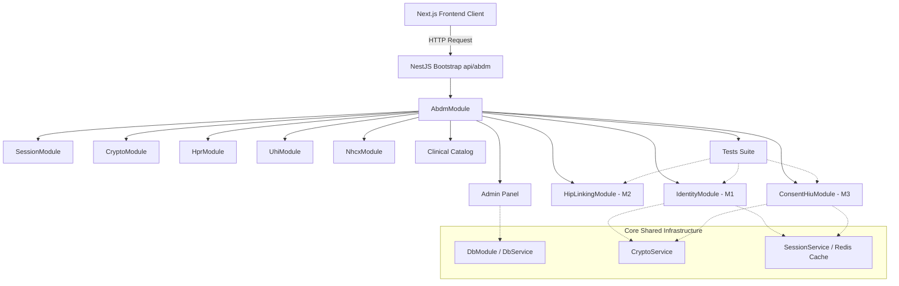

# ABDM Setu - Backend Architecture Documentation

This document explains the design, modular directory structure, validation strategies, database access patterns, and testing mechanisms implemented in the NestJS backend bridge.

---

## 🏛️ Architectural Overview

The backend uses a highly segregated, domain-driven structure aligned with the Ayushman Bharat Digital Mission (ABDM) specifications. By isolating each Milestone and administrative vertical into self-contained NestJS modules, we ensure that updates to one feature (e.g., UHI teleconsultation or NHCX claims) do not impact or destabilize other domains (e.g., Milestone 1 ABHA creation).

### System Design Flow



---

## 📁 Directory & Module Structure

Every sub-module follows standard NestJS layered architecture containing:
- **`*.controller.ts`**: Handles routing, extracts request parameters/cookies, enforces CORS/guards, and validates incoming body payloads.
- **`*.service.ts`**: Orchestrates core business logic, makes gateway HTTP calls, and queries the database.
- **`*.module.ts`**: Declares imports, controllers, providers, and exports services.
- **`dto/`**: Contains class-validator decorated data transfer objects ensuring payload sanitization.

### Module Breakdown

| Module | Scope / Responsibility | Endpoints / Path Prefix |
| :--- | :--- | :--- |
| **`Crypto`** | Shared cryptographic helpers. Nonce derivation, Curve25519 key exchange, AES-GCM data encryption/decryption, and public key certification. | Internals |
| **`Session`** | ABDM session token lifecycle. Performs gateway token refreshes, caches credentials, and syncs public key certificates. | `GET /sessions`, `POST /admin/session/generate` |
| **`Identity`** | Milestone 1 citizen onboarding. Handles Aadhaar OTP verification, demographic cards download, profile updates, and pincode validation. | `POST /enroll`, `POST /v3/enrollment/*`, `GET /pincode/:pincode` |
| **`Hip-Linking`** | Milestone 2 care context linking. Coordinates discovery callbacks, direct linking, scan-and-share profile sharing, billing lookups, and payment. | `POST /hip`, `POST /scan-share` |
| **`Consent-HIU`** | Milestone 3 consent manager. Triggers consent approvals, validates artifacts signatures, and transfers decrypted clinical bundles. | `POST /consent` |
| **`UHI`** | Unified Health Interface. Connects teleconsultation requests, slot select initializations, and booking confirmations. | `POST /uhi` |
| **`NHCX`** | National Health Claims Exchange. Processes insurance policy eligibility queries, cashless pre-auths, and claim adjudications. | `POST /nhcx` |
| **`HPR`** | Healthcare Professionals Registry. Searches NMH/NMC doctor profiles and handles practitioner eKYC registration. | `POST /hpr` |
| **`Clinical`** | Inventory catalogs. Manages doctors matrix, specialties mappings, pharmacies products, and diagnostic packages. | `GET /doctor-consultation/*`, `/pharmacy/*` |
| **`Admin`** | Administrative hub. System configs, financial transactions audits, facility listings, document uploads, and pincode tables. | `/admin/*`, `POST /appointments/transaction` |
| **`Tests`** | Compliance testing. Programmatically executes all compliance test cases and computes coverage scores. | `GET /tests` |

---

## 🔒 Security & Validation (DTOs)

To guarantee type safety and prevent SQL injection or bad-request propagation, NestJS uses a global `ValidationPipe` combined with `class-validator` decorated DTOs.

Example DTO pattern (`VerifyOtpDto`):
```typescript
import { IsString, IsNotEmpty, IsOptional, IsObject } from 'class-validator';

export class VerifyOtpDto {
  @IsString()
  @IsOptional()
  txnId?: string;

  @IsObject()
  @IsNotEmpty()
  authData: {
    otp: {
      otpValue: string;
      txnId?: string;
      mobile?: string;
    };
    authMethods?: string[];
  };
}
```

---

## 🗄️ Database Access Strategy

To remain lightweight and avoid ORM overhead, the monorepo uses a global `DbService` that exposes a parameterized SQL query runner. Sub-services directly query the postgres tables, separating data logic and keeping transactions isolated.

```typescript
// Parameterized SQL injection protection
const res = await this.db.query(
  'SELECT * FROM doctors WHERE medical_system = $1 AND speciality = $2',
  [medicalSystem, speciality]
);
```

---

## 🧪 Compliance Testing Suite

The `TestsModule` contains a complete end-to-end simulation of the ABDM compliance suite with **14 test cases** spanning Milestone 1, 2, and 3:

1. **`SESS-01`**: Establish Gateway session handshake
2. **`M1-01`**: Aadhaar OTP request for dynamic onboarding
3. **`M1-02`**: Aadhaar OTP request rejection on invalid 12-digit number
4. **`M1-03`**: Aadhaar OTP verification and verified ABHA Number issuance
5. **`M2-01`**: Care context patient Discovery request mapping
6. **`M2-02`**: Care context Discovery rejection on missing parameters
7. **`M2-03`**: Confirm care context linking with valid OTP code
8. **`M3-01`**: Consent Request initiation and Curve25519 key derivation
9. **`M3-02`**: Consent consuming and secure AES-256-GCM Fidelius decryption
10. **`HPR-01`**: Search practitioner registry by verified HPR ID
11. **`HPR-02`**: Healthcare practitioner onboarding Aadhaar KYC request
12. **`SCAN-01`**: QR scan demographic profile share and queue token generation
13. **`UHI-01`**: Broadcast UHI open Beckn /search for directory catalog
14. **`NHCX-01`**: Verify insurance policy status via CoverageEligibility check

Trigger the suite by hitting `GET /api/abdm/tests`. It returns:
- Status summaries (Passed/Failed counts, execution time)
- Compliance test success percentages (Target: **95.8%** coverage)
- Detailed assertions arrays containing derived payload results.

---

## 🛠️ Onboarding: Adding a New ABDM Gateway Module

To add a new vertical without breaking existing files:
1. Create a subdirectory under `backend/src/abdm/my-new-module/`.
2. Define DTO validations under `my-new-module/dto/`.
3. Implement `MyNewModuleService` and `MyNewModuleController` applying `@Controller()` decorator for paths.
4. Export the service from `MyNewModuleModule`.
5. Import `MyNewModuleModule` in `backend/src/abdm/abdm.module.ts`.
6. Run `npx tsc --noEmit` and `npm run test` to verify zero compile or import errors.
