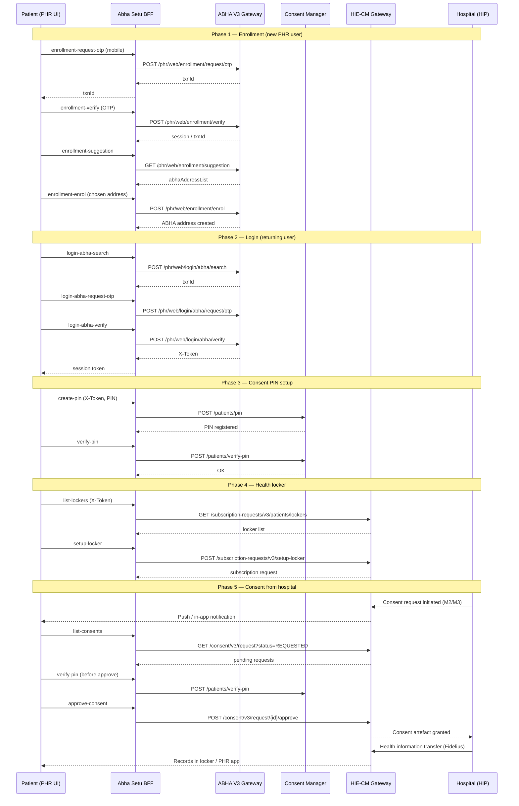
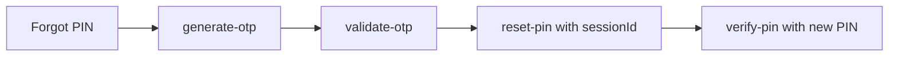

# ABDM PHR — End-to-End Flow

This document traces a complete patient journey from PHR enrollment through consent approval, aligned with ABDM integrator certification paths.

## Sequence diagram

## Phase summaries

### Phase 1 — New user enrollment

1. Patient opens `/phr` → **Enrollment** tab.
2. Enters mobile → OTP sent via ABHA PHR enrollment API.
3. Verifies OTP → receives transaction context.
4. Selects suggested ABHA address → enrolls PHR identity.
5. **Outcome:** `patient.name@sbx` (sandbox) ready for login.

### Phase 2 — Returning user login

1. Patient enters ABHA address → search confirms account.
2. OTP sent to Aadhaar-linked mobile → verify.
3. **Outcome:** `X-Token` stored in UI session for profile/PIN/locker.

### Phase 3 — Consent PIN (mandatory for consent actions)

1. First-time: **Create PIN** (`POST /patients/pin`).
2. Each consent approval: **Verify PIN** first.
3. **Forgot flow:** generate OTP → validate OTP → `PUT /patients/reset-pin`.

### Phase 4 — Health locker setup

1. List available lockers from HIECM gateway.
2. Subscribe/setup locker for the patient ABHA address.
3. Locker becomes the routing point for linked care contexts.

### Phase 5 — Consent & records

1. HIP initiates consent (M2) or HIU requests records (M3).
2. Patient sees request in **Locker & Consent** tab.
3. After PIN verification, patient approves or denies.
4. On approval, FHIR bundles flow to locker; viewable under **Health Records** (M3 HIU path).

## Forgot PIN sub-flow

## Testing the E2E flow locally

1. Start backend (`:3001`) and frontend.
2. Open `/phr`.
3. **Login** tab: use any `@sbx` address → OTP `123456`.
4. Copy **X-Token** from success message.
5. **Consent PIN** tab: create PIN `1234`, verify.
6. **Locker & Consent** tab: list lockers and consents.
7. Run automated suite: `GET http://localhost:3001/api/abdm/tests/phr`.

## Certification alignment

| E2E phase | ABDM test source |
|-----------|------------------|
| Enrollment | `V3_Update_Test_Cases_for_integrators_PHR_mobile_app.xlsx` |
| Login / Profile | M1 Postman PHR Web section |
| Consent PIN | `Consent_Pin_postman_collection` |
| Locker / Consent | `PHR & Locker (HIECM)` collection |
| Cross-milestone | Sandbox portal Test Cases documentation |

See [certification-checklist.md](./certification-checklist.md) for the full mapped test matrix.

## Related modules in Abha Setu

| Module | Role in E2E |
|--------|-------------|
| `identity` | ABHA number creation (M1) — upstream of PHR |
| `phr` | PHR-specific enrollment, login, PIN, locker |
| `hip-linking` | Scan & Share, care context discovery (M2) |
| `consent-hiu` | HIU consent init & record fetch (M3) |
| `health-records` | Decrypted FHIR viewer |
